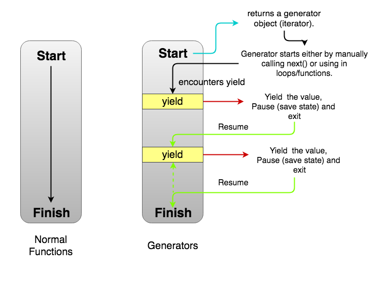

# Generators

* A generator is a function that can stop midway and then continue from where it stopped. In short, a generator appears to be a function but it behaves like an iterator.
* The Generator object is returned by a generator function and it conforms to both the iterable protocol and the iterator protocol.



```js
function* generator() {
    yield 1;
    yield 2;
    yield 3;
}

const gen = generator();

console.log(gen.next().value); // 1
console.log(gen.next().value); // 2
console.log(gen.next().value); // 3
```