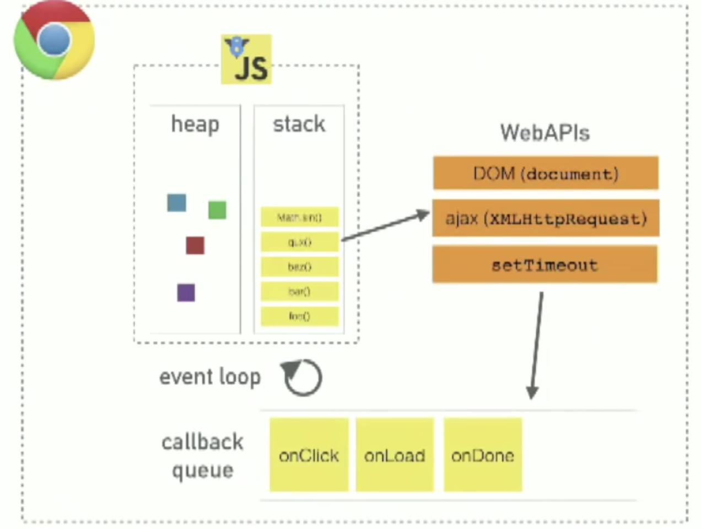

# How event loop works in JavaScript, async concept

* JavaScript is synchronous, blocking and single threaded language by default.
* There are few ways to make it behave asynchronous no-blocking.
* This can be done by using *callback*, *promises* and *async/await* functions.

Basic architecture
---



How is JavaScript asynchronous and single-threaded ? 

The short answer is that JavaScript language is single-threaded and the asynchronous behaviour is not part of the JavaScript language itself, rather they are built on top of the core JavaScript language in the browser (or the programming environment) and accessed through the browser APIs.

Let's analyse how event loop works. OPen link below:

[JS internals](https://learningqueue.org/js/index.html)

paste code:

```js
console.log("Hi!");

setTimeout(function timeout() {
    console.log("Greeting from WEB api");
}, 5000);

console.log("Welcome to JS internals.");
```