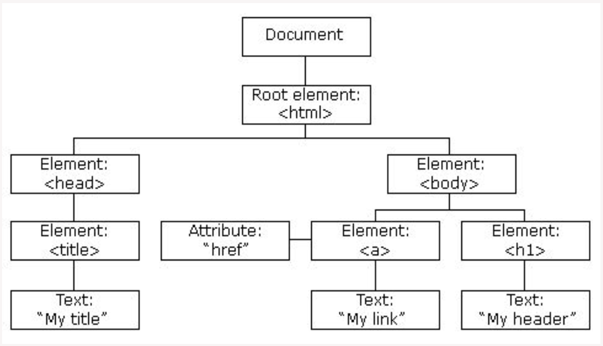

# Interaction with DOM

DOM - Document Object Model. It’s the data representation of objects used to build structure and the content of the web page. Therefore, it could be accessed via javascript using DOM API. Styles, content and structure could be changed and manipulated

DOM example:



Common API calls

```js
document.getElementById('hello'); 
document.getElementsByTagName ('p'); 
document.querySelector('.hello'); 
document.querySelectorAll('#hello') 
document.createElement('div'); 
element.appendChild(elementChild);
element.innerHTML = '<p>Hello world!</p>'; 
element.style.left = '20px'; 
element.setAttribute('data-name', 'John'); 
element.getAttribute('data-name'); 
element.addEventListener('click', (e) => alert('clicked!');
```